# QueenStore - Introduction
QueenStore is an online marketplace where users can buy online or sell online any afghan women handicrafts.This website able Users to add their own products for sale on and buy a product by contact and communicate to seller.

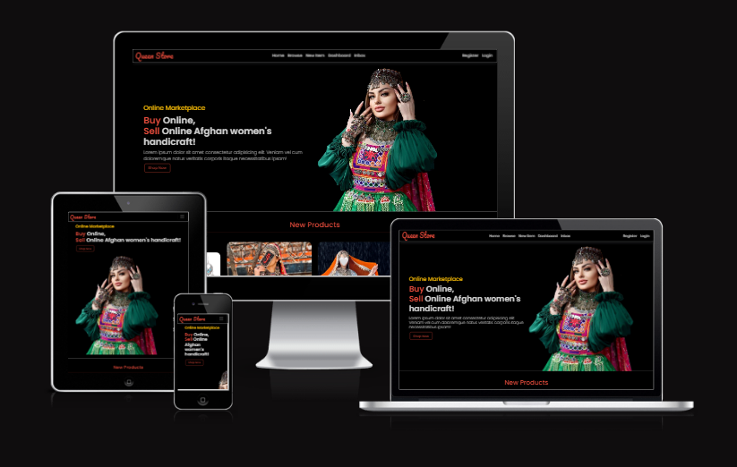 

The Live Site can be found [here](https://queen-store.herokuapp.com/).

# User Experience & user stories
## Admin
* As an admin I can navigate the admin panel so that I can create, read, update and delete products on website. 

## register User
* As a registered user I can click the the inbox so that see who send me message.
* As a registered user I can click on products in my dashboard so that I can edit or delete them.
* As a registered user I can add new product so that I can sell my product.
* As a registered user I can see list of my products so that I can view a list of products added by me.
* As a registered user I can I can click on a product so that I can contact to seller and send message.

## General User
* As a general user I can clear filter that I have chosen before so that I can see all products.
* As a general user I can search items based on title and description so that I can find easily specific product.
* As a general user I can browse products based on their categories so that I can find list of products belongs to each category.
* As a general user I can view categories so that I can read how many products belongs to each category.
* As a general user I can view list of products so that I can select one to see the description.
* As a general user I can click on a product so that I can see the detail of product.

  

## Design

### Color Scheme

The main colour schemes for the website are black, light gray and oranged color. The site uses black color for the background and light gray and oranged color for the text.
These colours were used throughout all the pages in such a way as to ensure adequate contrast and good user experience.

* orange color (#e74c3c)

  

* light gray color (#d3d3d3)

  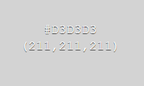

### Fonts

The fonts selected were from Google Fonts, Poppins, Exo, Pacifico with sans-serif as a backup font.

## Structure

### Website pages

Simplicity, clarity and ease of navigation between pages were the main aspects for design of this website's structure.

At the top of the page there is a recognisable type of navigation bar with website name on the left side and the navigation links to the right which collapses to hamburger icon on smaller screen sizes. At the bottom of the page there is a footer with links to a contact page and social media.

- The website consists of the following sections:
  - Home page with an overview of the content, aim of the website, new products, and categories.
  - Browse page where a user can see the product's categories,
  and search specific product based on name and description.
  -  once user choose a product user can click on it and see the detail of product like name, price, related images, descriptions and contact to seller.
  - on dashboard page user can see list of own products and can edit or delete each products.
  - the product owner can see the inbox to check who contact to buy a specific product and send message to customer.
  - registerd user can also add products to sell on new item page.
  - Login page for returning user to log in.
  - Register page allowing a new user to sign up.
  - Logout page allowing user to log out of the website.
 

# Database
* The backend consists of Python built with the Django framework with a database of a ElephantSQL for the deployed version.

* The following models were created to represent the database model structure for the website:

### Item Model
* The item model contains information about the item.
* The item model contains the following fields: category, name, price, image, rear_image, description, is_sold, created_by, created_at.
* The model has one-to-many relationships with User and Category Model

### Category Model
* The category model contains name of categories.

### Conversation Model
* The conversation model handles communication between users.
* conversation model contains the following fields: item, members, created_at, modified_at.
* The model has one-to-many relationships with User and Item Model

### ConversationMessage Model
This model contains the following fields: conversation, content, created_by, created_at.
The ConversationMessage model has a one-to-many relationship with Conversation Model.

# Features
## Existing Features

* **Navbar**
    * The navbar is responsive depending on whether a user is logged in or not, and the width of the screen. The navbar is fixed in place and is visible on every page and can redirect user to any page they want.
            

* **Home Page**
    * The home page consists of a general description about the website, a list of New products added by different users. clicking on one of the products directs the user to product detail page. and also users can look how many items related to each categories.
                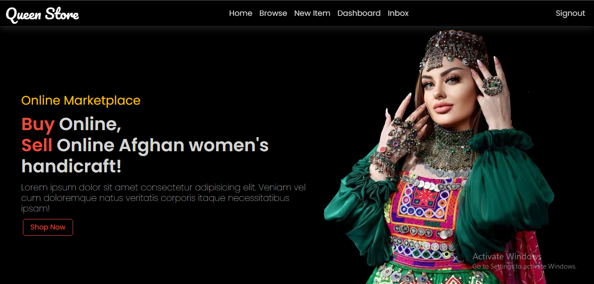
                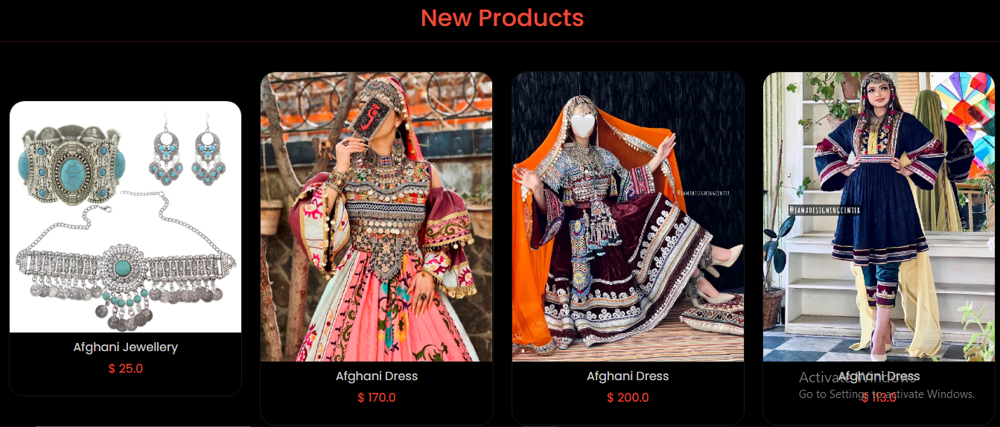
                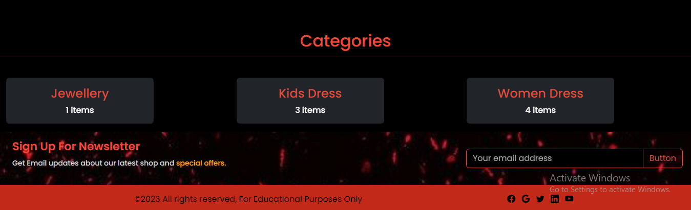

* **Detail Page**
    * when user click on a specific product they will redirect to detail page. 
    * in detail page user can see the detail of product. if the user is owner then the user can edit or delete the product. 
    

    
    * if the user is not owner then the user can contact seller to communicate with seller.

      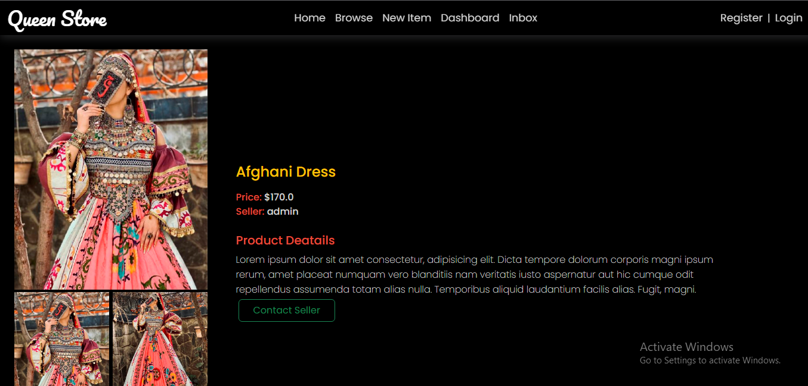

    * if user click on contact seller the coversation page appears.
      

    * and also the related items also appear in this page.

      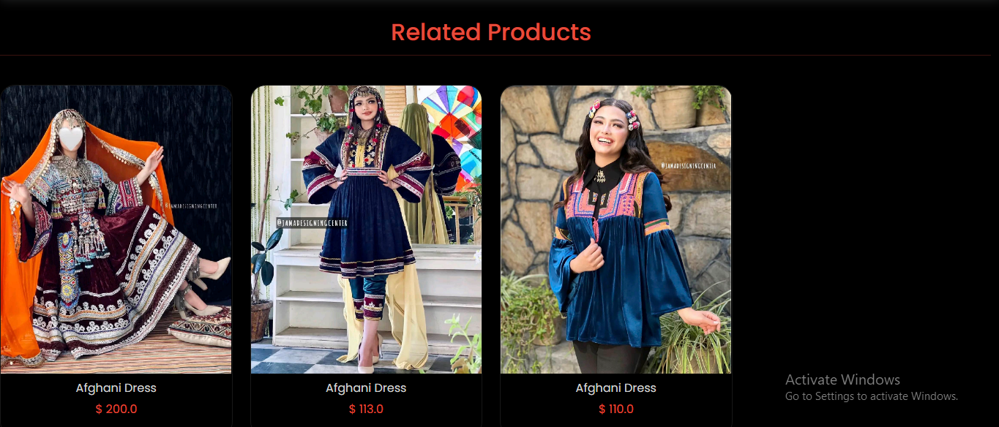

   * **Browse Page**
    * In browse page user can see the categories of products and search specific product based on name and description.
    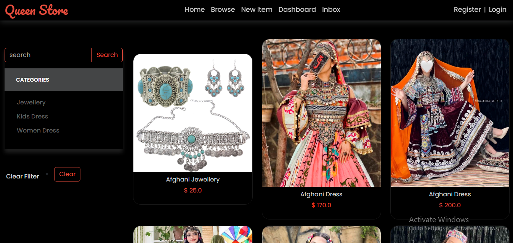
    
   * **New Item Page**
    * In new item page registered user can add products to sell and unregistered user will redirect to login page. 
    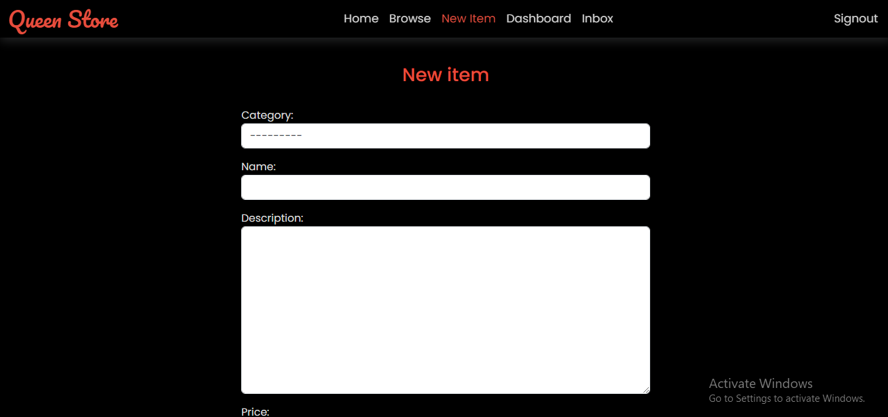

   * **dashboard Page**
    * In dashboard users can see list of their own products. 
    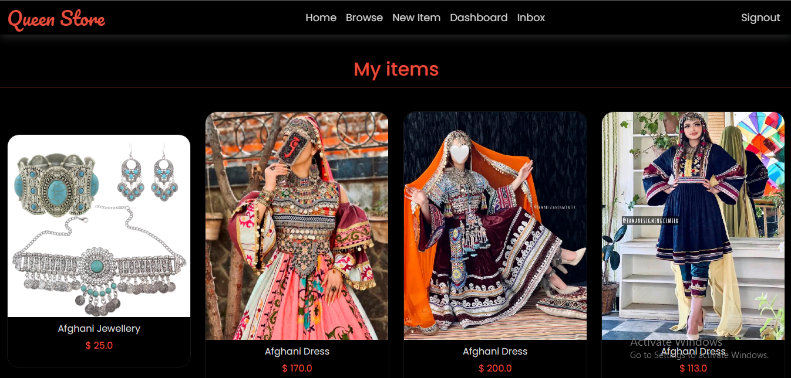

  * **Inbox Page**
  * In Inbox page user can see list of messages related to specific products. 
    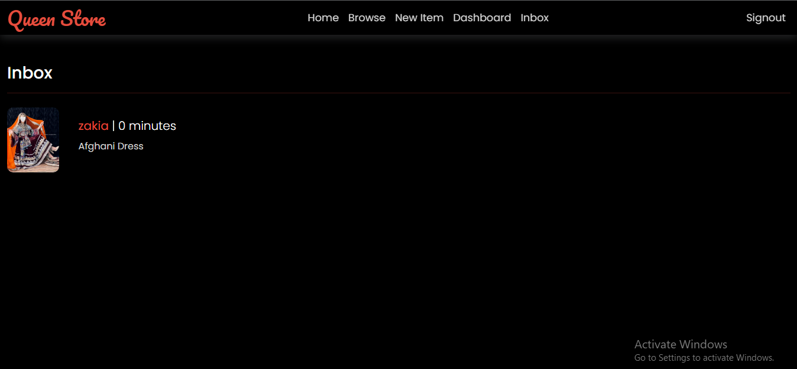

  * if user click on a specific message the conversation page appear. 
    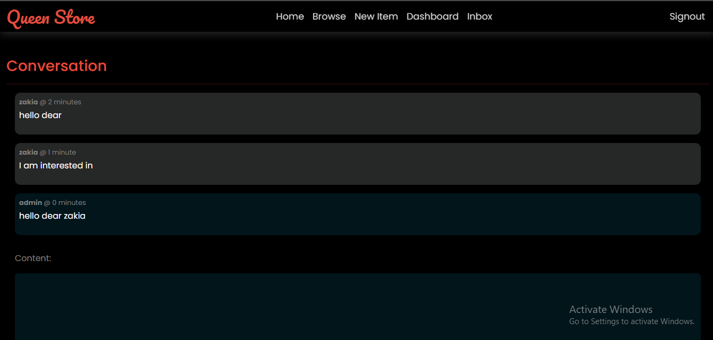

        
* **Sign Up**
    * Users can register and create their own account. 
    * The sign-up form checks if the username is used by someone else, alerts the user if any infomration is incorrect, such as passwords not matching or empty required fields.
    * Creating account enables access to more features. 
         
      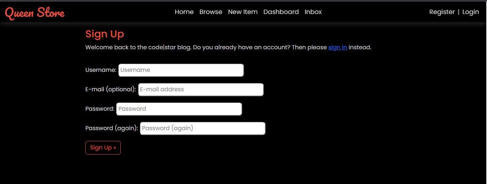
    
* **Sign In**
    * Users can access their account via sign-in/login feature.
   
    * Users can find login option from Menu and from home page.
    * If the user don't have an account, they can click 'sign up' link on the login page and create their account.
        
      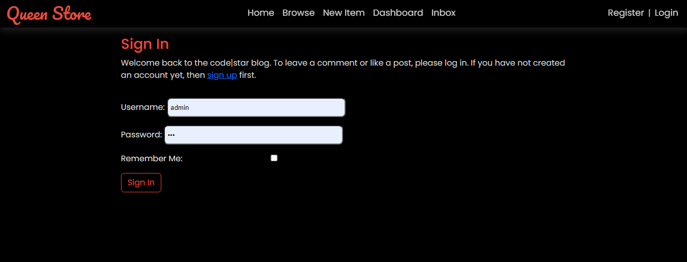

* **Logout**
    * The user can logout from Menu and from their accounts page.
    * The logout modal asks the user if they confirm to logout.

         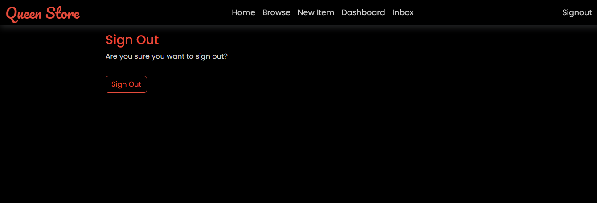
 

## Technologies Used

### Languages & Frameworks

- HTML
- CSS
- Javascript
- Python
- Django

### Libraries & Tools

- [Am I Responsive](http://ami.responsivedesign.is/)
- [Bootstrap v5.2](https://getbootstrap.com/)
- [Cloudinary](https://cloudinary.com/)
- [Chrome dev tools](https://developers.google.com/web/tools/chrome-devtools/)
- [Git](https://git-scm.com/)
- [GitHub](https://github.com/)
- [Google Fonts](https://fonts.google.com/)
- [Heroku Platform](https://id.heroku.com/login)
- [Postgres](https://www.postgresql.org/)
- Validation:
  - [WC3 Validator](https://validator.w3.org/)
  - [Lighthouse](https://developers.google.com/web/tools/lighthouse/)

## Testing

### Testing Strategy
I utilised manual and validator testing strategy for the development of the site.
Seperate to the functionality testing of the site, and the testing of the code, User Story tests were implemented to ensure that the criteria of the user stories listed above were met.

### Validator Testing
The site's HTML, CSS and Python codes are validated by the W3C Markup Validation Service, W3C CSS Validation Service and PEP8 ONLINE service.

* HTML
HTML docs were run through the W3C Markup validation and passed the validation.
- W3C HTML Validation Report
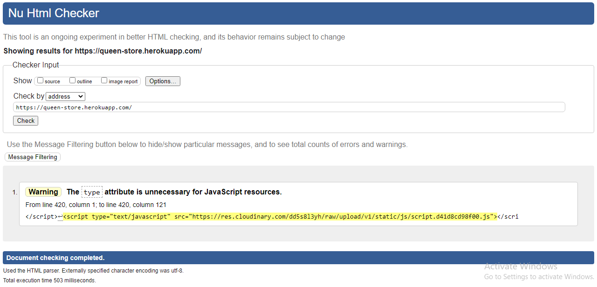

* Css 
All CSS files ran through CSS jigsaw validator with some bootstrap errors that can be ignored.

- W3C CSS Validation Report

## Manual Testing
### Site testing
- I manually tested the site's navigation menu links and all buttons accross the site's all pages that all work fine in terms of loading and redirecting URLs to the relavant pages.

### Register form testing
- I manually tested the register form's password fields. The password needs to meet certain requirements when user regsiter an account.

### User exists
- I manually tested that it's not possible to register an account with the same username or the same email address.

### Login form testing
- I manually tested the login form. The username and the password needs to be the same as user specified when registering an account.

### New Item form testing
- I manaually tested the new item form. the new item must meet certain criteria. 

# Deployment:
This project was deployed to Heroku. "Heroku is a cloud platform that lets companies build, deliver, monitor and scale apps."- [Heroku.](https://www.heroku.com/)

I used Code Institute GitPod full template to set up an environment to created the project. Installed Django and required packages / libraries using commands in GitPod terminal.

- pip3 install Django==3.2 gunicorn

- pip3 install dj3-cloudinary-storage

- pip3 freeze --local > requirements.txt

## Deployment of This Project
This site was deployed by completing the following steps:
1. Log in to Heroku or create an account
2. On the main page click the New in the top right corner and from the drop-down menu select Create New App
3. You must enter a unique app name
4. Next select your region
5. Click on the Create App button
6. Click in resources and select Heroku Postgres database
7. Click Reveal Config Vars and add a new record with SECRET_KEY
8. Click Reveal Config Vars and add a new record with the CLOUDINARY_URL
9. Click Reveal Config Vars and add a new record with the DISABLE_COLLECTSTATIC = 1
10. The next page is the project’s Deploy Tab. Click on the Settings Tab and scroll down to Config Vars
11. Next, scroll down to the Buildpack section click Add Buildpack select python and click Save Changes
12. Scroll to the top of the page and choose the Deploy tab
13. Select Github as the deployment method
14. Confirm you want to connect to GitHub
15. Search for the repository name and click the connect button
16. Scroll to the bottom of the deploy page and select the preferred deployment type
17. Click either Enable Automatic Deploys for automatic deployment when you push updates to Github

### Final Deployment
- Create a Procfile web: gunicorn your_project_name.wsgi
- When development is complete change the debug setting to: DEBUG = False in settings.py
- In Heroku settings, delete the config vars for DISABLE_COLLECTSTATIC = 1

### Cloning This Project
Clone this project by following the steps:
- Open GitHub
- You will be provided with three options to choose from, HTTPS, SSH or GitHub CLI, click the clipboard icon in order to - copy the URL
- Once you click the button the fork will be in your repository
- Open a new terminal
- Change the current working directory to the location that you want the cloned directory
- Type 'git clone' and paste the URL copied in step 3
- Press 'Enter' and the project is cloned

# Credits
During the process of project development, there have been various sources that gave me idea how to do a particular feature or fix a bug. The following are the sources that I got knowledge from:
* [Django Allauth](https://django-allauth.readthedocs.io/en/latest/#)
* [Code Instiute](https://codeinstitute.net/se/full-stack-software-development-diploma/?utm_term=code%20institute&utm_campaign=CI+-+SWE+-+Search+-+Brand&utm_source=adwords&utm_medium=ppc&hsa_acc=8983321581&hsa_cam=14660337051&hsa_grp=134087657984&hsa_ad=581817633089&hsa_src=g&hsa_tgt=kwd-319867646331&hsa_kw=code%20institute&hsa_mt=e&hsa_net=adwords&hsa_ver=3&gclid=Cj0KCQjw0PWRBhDKARIsAPKHFGgmnuTJCpzeJBqKg9fy2p-7NlU8NY95XaXmoPzBpuDdIekQWqUKxocaAso5EALw_wcB) course materials and Django Blog Walkthrough Project.
* [Bootstrap](https://getbootstrap.com/docs/5.0)

* [AmIResponsive](http://ami.responsivedesign.is/) for mockup of the site.

* The website has been created following YouTube tutorials and stack overflow.

* All images were taken from [jama design](https://jama.af/)
